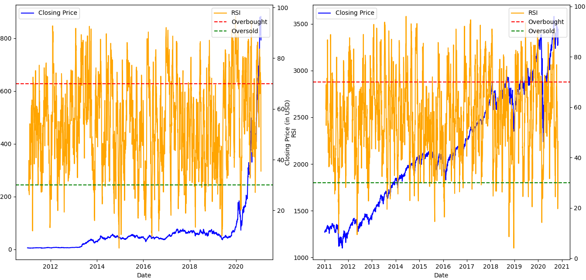
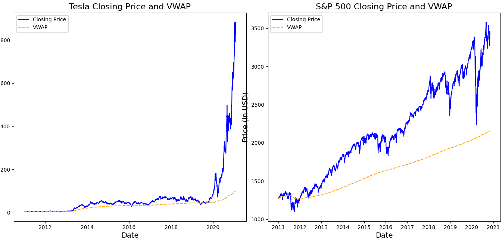

# Tesla vs S&P 500 Stock Analysis

## 📘 Project Overview

This repository contains an in-depth analysis comparing the stock performance of Tesla and the S&P 500 index from 2011 to 2021. It includes visualizations and key insights into financial trends, trading volumes, and other metrics, leveraging Python and advanced data analytics techniques.

---

## 🔍 Key Insights

1. Tesla's stock exhibits significantly higher volatility compared to the S&P 500.
2. Periods of overbought and oversold conditions were identified using the RSI indicator.
3. A positive correlation exists between Tesla's performance and the S&P 500 during certain timeframes.
4. Detailed analysis highlights Tesla's trading volume trends and their relationship with closing prices.

---

## 📊 Visualizations

### Average Monthly Returns


### Yearly Closing Prices


### 2-Day Percentage Changes After Earnings Announcements


### Correlation Between Tesla and S&P 500 Daily Returns


### Distribution of Daily Returns


### Tesla Closing Price and RSI Analysis


### Yearly Average Trading Volume Trends


### Tesla Closing Price and VWAP


### Correlation Between Yearly Closing Prices and Volume


---

## 🛠 Tools and Technologies

- **Python Libraries**:
  - `pandas` and `numpy`: For data manipulation and calculations.
  - `matplotlib` and `seaborn`: For creating visualizations.
- **Data Sources**:
  - **Tesla Data:** `better tesla data.csv` (processed Tesla stock data).
  - **S&P 500 Data:** `SPX.csv` (S&P 500 index data).
- **Files**:
  - Analysis script: `TslaAnalysisCode.py`.

---

## 🚀 How to Run the Analysis

1. Clone this repository to your local machine:
   ```bash
   git clone https://github.com/segevcoh7/Tesla-vs-SPX-Analysis.git
